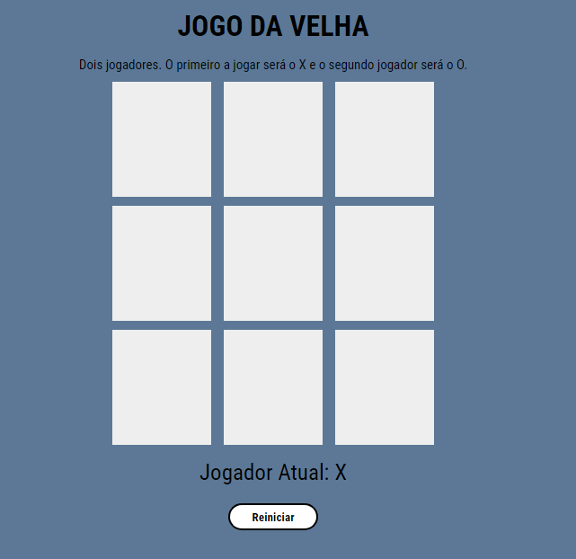

## Jogo da Velha

* Necesário dois jogadores. 
* O primeiro a jogar deve clicar sobre um dos quadrados do tabuleiro e automaticamente será o jogador X e o segundo jogador será o jogoador O.

### Tela Inicial do jogo:

### Tela com resultado da partida:

